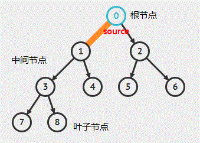
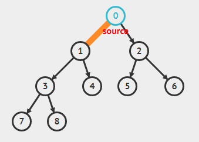
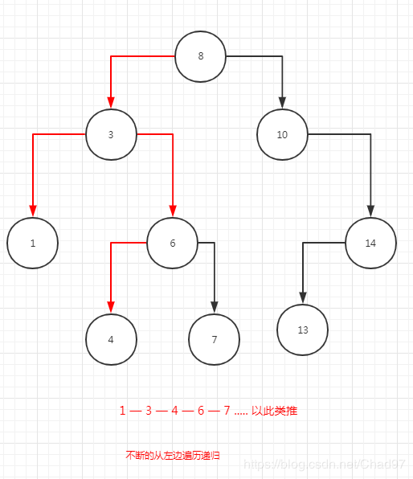
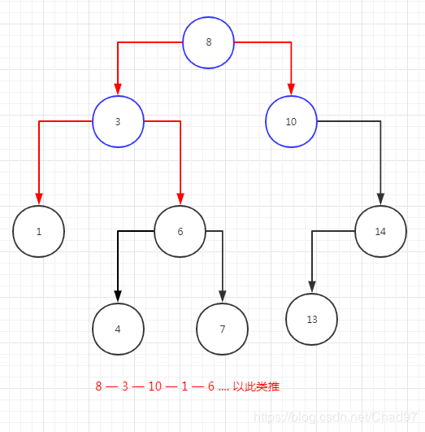
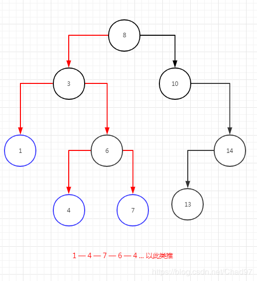

### 二叉树
> 在计算机科学中，二叉树是每个结点最多有两个子树的树结构。通常子树被称作“左子树”（left subtree）和“右子树”（right subtree）。二叉树常被用于实现二叉查找树和二叉堆。
> 一棵深度为k，且有2^k-1个节点的二叉树，称为满二叉树。这种树的特点是每一层上的节点数都是最大节点数。而在一棵二叉树中，除最后一层外，若其余层都是满的，并且最后一层或者是满的，或者是在右边缺少连续若干节点，则此二叉树为完全二叉树。具有n个节点的完全二叉树的深度为floor(log2n)+1。深度为k的完全二叉树，至少有2k-1个叶子节点，至多有2k-1个节点。。

- 以上是书面解答 —— 下面我总结一下

 #### 结构

- 二叉树分为 ： 根节点 —— 中间节点 ——叶子节点
1. 根节点是没有子节点的
2. 中间节点有子节点也有父节点
3. 叶子节点只有父节点没有子节点

#### 执行方式


- 小于父节点的节点放在左边 大于的放在右边 以此类推 不断的递归

```js
function BinaryTree () {
                //创建对象
                class Node {
                    constructor (key) {
                        this.key = key
                        this.left = null
                        this.right = null
                    }
                }
                //初始化root
                let root = null
                
                const  insertNode =  (node, newNode) => {
                        if (newNode.key < node.key) {
                        if (node.left === null) {
                            node.left = newNode
                        } else {
                            insertNode(node.left, newNode)
                        }
                    } else {
                        if (node.right === null) {
                            node.right = newNode
                        } else {
                            insertNode(node.right, newNode)
                        }
                    }
                }


                    
                this.insert = (item) =>{
                    let newNode = new Node(item)
                    if (root === null) {//判断是否有根节点
                        root = newNode
                    } else {
                        insertNode(root, newNode)//调用二叉处理方法
                    }
                }

                //中序排序
                const inOrderTraverseNode = (node, callback) => {
                    if (node !== null) {
                        inOrderTraverseNode(node.left, callback)
                        callback(node.key)
                        inOrderTraverseNode(node.right, callback)
                    }
                }

              

                //前序遍历
                const preOrderTraverseNode = (node, callback) => {
                    if (node !== null) {
                        callback(node.key)
                        preOrderTraverseNode(node.left, callback)
                        preOrderTraverseNode(node.right, callback)
                    }
                }

                

                //后序遍历
                const postOrderTraverseNode = (node, callback) => {
                    if (node !== null) {
                        postOrderTraverseNode(node.left, callback)
                        postOrderTraverseNode(node.right, callback)
                        callback(node.key)
                    }
                }

               

                this.allOrderTraverse = (callback, FuncName) => {//入口函数
                    switch (FuncName) {
                        case 'inOrderTraverseNode': inOrderTraverseNode(root, callback)
                            break
                        case 'preOrderTraverseNode': preOrderTraverseNode(root, callback)
                            break
                        case 'postOrderTraverseNode' : postOrderTraverseNode (root, callback)
                            break
                        default: alert('输入错误,请输入：inOrderTraverseNode，preOrderTraverseNode，postOrderTraverseNode 中的一种 ') 
                        break;
                    }
                }             

            }

            let nodes = [8, 3, 10, 1, 6, 14, 4, 7, 13]

            var BinaryTree = new BinaryTree()
            nodes.forEach(function (key) {
                BinaryTree.insert(key)
            })
            BinaryTree.allOrderTraverse(key => {console.log(key)}, 'postOrderTraverseNode')
```
- 复制这段代码到页面的`script`标签中 断点调试 


### 代码分析
1. `Node` 初始化的节点对象 它包含 `left` `right` 属性
2. `insert` 判断是否有根节点，没有的话初始化当前的key为根节点
3. insterNode 执行二叉法 
  -  判断新节点的 `left` 和 `right`是否为空 为空的话让其赋值
  -  小于的放 `left` 大于的 放 `right`
  -  如果出现既`小于` || `大于` 又不为空的情况 那就递归执行 `insterNode（newNode.left || right , newNode）` 置到 能给子节点赋值为止

#### 中序排序
- 代码实现
```js
//中序排序
                const inOrderTraverseNode = (node, callback) => {
                    if (node !== null) {
                        inOrderTraverseNode(node.left, callback)
                        callback(node.key)
                        inOrderTraverseNode(node.right, callback)
                    }
                }
```

- 图片演示



#### 前序排序
- 代码实现

```js
//前序遍历
                const preOrderTraverseNode = (node, callback) => {
                    if (node !== null) {
                        callback(node.key)
                        preOrderTraverseNode(node.left, callback)
                        preOrderTraverseNode(node.right, callback)
                    }
                }
```
- 图片演示
  

#### 后序排序
- 代码实现
```js
 //后序遍历
                const postOrderTraverseNode = (node, callback) => {
                    if (node !== null) {
                        postOrderTraverseNode(node.left, callback)
                        postOrderTraverseNode(node.right, callback)
                        callback(node.key)
                    }
                }
```

- 图片演示
  

### 总结
- 二叉树的算法在海量数据的排序上相比于其他排序算法效率要高很多，
1. 中序遍历相当于数组的升序排列，
2. 前序遍历是对相同二叉树的赋值，但是对于重新排列一个相同结构二叉树来说，效率也要高很多，
3. 后序遍历相当于对数组的降序排列