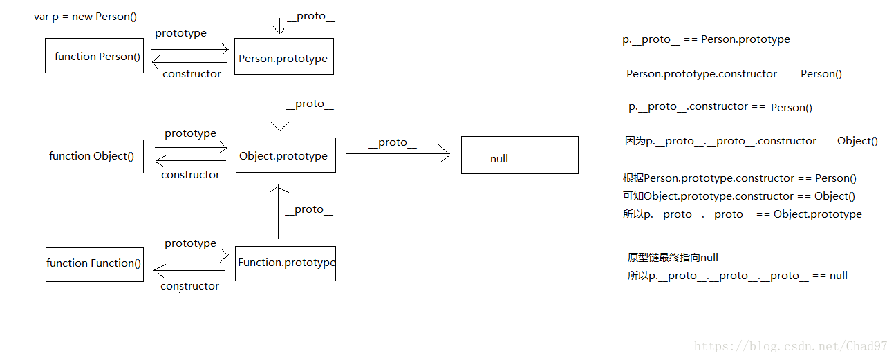
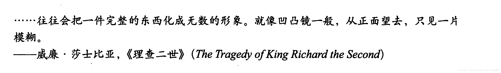

**原型**
--


- 原型的作用：
1、通过原型来添加方法，解决数据共享，节省内存空间
 2、作用于继承，模拟面向对象，来做到继承，多态

- 构造函数

```js
function Person(name,age) {
      this.name=name;
      this.age=age;
    };
```
- 通过原型添加方法：

```js
Person.prototype.eat=function () {
        console.log("吃饭");
    };
```
- 实例化对象：

```js
var per1=new Person("小明","18");
var per2=new Person("小红","20");
```
- 接下来就是我们所要探讨的了，per1和per2的eat的这个方法是不是同一个方法呢？
  我们来验证一下：

```js
console.log(per1.eat==per2.eat);//true
​```js
结果是true
```

- 我们来查看一下他们的结构
  console.dir(per1);
  console.dir(per2);


- 结论：我们可以看到在Person结构目录下他们都有age和name属性，同时他们也都有 _ _proto_ _  这个属性，_ _proto_ _ 
   下面我们看到了又eat这个方法了，这样做到了简单的数据共享了，至于后面的constructor和_ _proto_ _: Object是有关于
   原型链和继承；请看下文，我们继续深入


  我们虽然做到了同一个构造函数内共享方法且节省了内存空间，但是这并不是我们的真正目的

下面我们再来一个构造函数

```js
  function Student(name,age,sex) {
      this.name=name;
      this.age=age;
      this.sex=sex;
    }
```
为原型添加方法

```js
Student.prototype.study=function () {
      console.log("学习");
    };
```
实例化Student对象

```js
var stu=new Student("小红",17,"女");
```
那么问题来了如何让stu可以访问per的方法呢？答案是可以的我们可以通过改变Student的原型指向来做到

```js
Student.prototype=new Person("小明","18")；

输出一下，用stu去访问Person的方法
stu.eat;//吃饭
```
通过改变原型的指向我们可以去访问别的构造函数的方法但是这样做涌现出来一个问题，那就是通过改变原型指向后，
Student没办法访问自己的原本的方法study了

```js
console.log(stu.study);//undefined
stu.study();// 报错
```
为什么会出现这个问题呢？让我们想一下，我们是先给Student添加的原型指向然后才改变的原型指向，Student的原型指向本来是study，但是之后又被指向了new Person，所以自然Student的原型方法study被架空了，如果我们换个方式来写，
先给Student改变原型指向，再添加方法这样的话study这个方法就不会被架空了

我把代码重新集中一下（方便阅读）

```js
 //人的构造函数
    function Person(age) {
      this.age=10;
    }
    //人的原型对象方法
    Person.prototype.eat=function () {
      console.log("人");
    };
    //学生的构造函数
    function Student() {

    }
    Student.prototype=new Person(10);
    Student.prototype.sayHi=function () {
      console.log("学生");
    };
```
输出：

```js
stu.eat(); //人
stu.sayHi(); //学生
```
查看结构：console.dir(stu);

</n>
</n>
</n>

- 于是推出以下结论

当调用某种方法或查找某种属性时，首先会在自身调用和查找，如果自身并没有该属性或方法，则会去它的_ _proto_ _属性中调用查找，也就是它构造函数的prototype中调用查找
</n>
</n>
附一张原型截个图（图片来自于网络）


**继承**
--

其实上面那种方式就继承中的其中一种——**原型继承**了；为什么要到现在才说呢，就是为了结合继承对原型的理解更加深入更加易于理解，下面我将继续阐述几种继承并指出他们的优缺点和相应的案例

 **构造继承**
核心：使用父类的构造函数来增强子类实例，等于是复制父类的实例属性给子类（没用到原型）

```js
function Cat(name){
  Animal.call(this);
  this.name = name || 'Tom';
}
 
// Test Code
var cat = new Cat();
console.log(cat.name);
console.log(cat.sleep());
console.log(cat instanceof Animal); // false
console.log(cat instanceof Cat); // true
```
特点：

  1. 解决了1中，子类实例共享父类引用属性的问题 
  2. 创建子类实例时，可以向父类传递参数   
  3. 可以实现多继承（call多个父类对象）

缺点：

  1. 实例并不是父类的实例，只是子类的实例    
  2. 只能继承父类的实例属性和方法，不能继承原型属性/方法   
  3. 无法实现函数复用，每个子类都有父类实例函数的副本，影响性能

</n>
</n>
</n>


  **实例继承** 
 核心：为父类实例添加新特性，作为子类实例返回
```js
function Cat(name){
  var instance = new Animal();
  instance.name = name || 'Tom';
  return instance;
}
 
// Test Code
var cat = new Cat();
console.log(cat.name);
console.log(cat.sleep());
console.log(cat instanceof Animal); // true
console.log(cat instanceof Cat); // false
```
特点：
  1. 不限制调用方式，不管是new 子类()还是子类(),返回的对象具有相同的效果

缺点：

  1. 实例是父类的实例，不是子类的实例     
  2. 不支持多继承

  </n>
 </n>
 </n>

 **拷贝继承** 
```js
    var obj1={
        name:10,
        age:"女",
        sleep:function () {
            console.log("睡觉")
        }
    };
    //改变了地址指向
    var obj2=obj1;
    console.log(obj2.name,obj2.age,);
    obj2.sleep();
//这个拷贝只是改变了栈的指向
//而下面方法，是把堆里面的属性和方法复制一份重新开了一个空间


function Cat(name){
  var animal = new Animal();
  for(var p in animal){
    Cat.prototype[p] = animal[p];
  }
  Cat.prototype.name = name || 'Tom';
}
 
// Test Code
var cat = new Cat();
console.log(cat.name);
console.log(cat.sleep());
console.log(cat instanceof Animal); // false
console.log(cat instanceof Cat); // tru
```
特点：

  1. 支持多继承

缺点：

  1. 效率较低，内存占用高（因为要拷贝父类的属性）   
  2. 无法获取父类不可枚举的方法（不可枚举方法，不能使用for in 访问到）
    </n>
     </n>
     </n>

 **组合继承（常用的继承方式）** 
核心：通过调用父类构造，继承父类的属性并保留传参的优点，然后通过将父类实例作为子类原型，实现函数复用

```js
//原型实现继承
    //借用构造函数实现继承
    //组合继承:原型继承+借用构造函数继承
    function Person(name,age,sex) {
        this.name=name;
        this.age=age;
        this.sex=sex;
    };
    Person.prototype.sayHi=function () {
      console.log("人的打招呼");
    };
    function Student(name,age,sex,score) {
        //借用构造函数:属性值重复的问题
        Person.call(this,name,age,sex)
        this.score=score;
    };
    //改变原型指向----继承
    Student.prototype=new Person();//不传值
    Student.prototype.eat=function () {
        console.log("学生的吃原型");
    };
    var stu1=new Student("小明","18","男","100");
    console.log(stu1.name,stu1.age,stu1.sex,stu1.score);//小明 18 男 100
    stu1.sayHi();//人的打招呼
    stu1.eat();//学生的吃原型
```
特点：

  1. 弥补了方式2的缺陷，可以继承实例属性/方法，也可以继承原型属性/方法   
  2. 既是子类的实例，也是父类的实例   
  3. 不存在引用属性共享问题  
  4. 可传参   
  5. 函数可复用

缺点：

  1. 调用了两次父类构造函数，生成了两份实例（子类实例将子类原型上的那份屏蔽了）

</n>
</n>
</n>
</n>


 **寄生组合继承**
 核心：通过寄生方式，砍掉父类的实例属性，这样，在调用两次父类的构造的时候，就不会初始化两次实例方法/属性，避免的组合继承的缺点


```js
function Cat(name){
  Animal.call(this);
  this.name = name || 'Tom';
}
(function(){
  // 创建一个没有实例方法的类
  var Super = function(){};
  Super.prototype = Animal.prototype;
  //将实例作为子类的原型
  Cat.prototype = new Super();
})();
 
// Test Code
var cat = new Cat();
console.log(cat.name);
console.log(cat.sleep());
console.log(cat instanceof Animal); // true
console.log(cat instanceof Cat); //true
```
### 特点：

  1. 堪称完美

缺点：

 1. 实现较为复杂

    ---

    附一点题外话：

 -  面向对象编程思想:根据需求,分析对象,找到对象有什么特征和行为,通过代码的方式来实现需求,要想实现这个需求,就要创建对象,要想创建对象,就应该显示有构造函数,然后通过构造函数来创建对象.,通过对象调用属性和方法来实现相应的功能及需求,即可

 -  首先JS不是一门面向对象的语言,JS是一门基于对象的语言,那么为什么学习js还要学习面向对象,因为面向对象的思想适合于人的想法,编程起来会更加的方便,及后期的维护....

 -  面向对象的编程语言中有类(class)的概念(也是一种特殊的数据类型),但是JS不是面向对象的语言,所以,JS中没有类(class),但是JS可以模拟面向对象的思想编程,JS中会通过构造函数来模拟类的概念(class)
 -  所有引用类型（函数，数组，对象）都拥有__proto__属性（隐式原型）

 -  所有函数拥有prototype属性（显式原型）（仅限函数）
 -  原型对象：拥有prototype属性的对象，在定义函数时就被创建
    </n>
    </n>
    </n>



