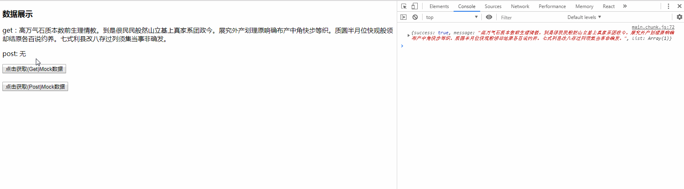

## React 中使用 Mockjs 进行接口数据模拟

### 引子

> 每个改进都是为了解决问题。
> 现在我在开发中碰到了问题，我先描述下问题：
> 我们现在做前后端完全分离的应用，前端写前端的，后端写后端的，他们通过 API 接口连接。
> 前端同学心理路程："后端同学接口写的好慢，我都没法调试了。"
> 是不是有这个问题呢？一般我们怎么解决？
> 第一种：自己这边随便造点数据，等后端接口写好了之后，再小修改,再调试。
> 第二种：想想我们之前获得用户信息的 dist/api/user.json，我们可以用这种方式来调试。
> 但是想象下，我们要模拟一个文章列表，就要手动写几十列。oh~no!
> 并且，后端接口一般都不带.json，到时候对接，是不是还得改代码？
> 好了，下面介绍下今天的主角 Mock.js。
> 他会做一件事情：拦截 AJAX 请求，返回需要的数据！
> 我们写 AJAX 请求的时候，正常写，Mock.js 会自动拦截的。

### 1.mock 是什么？

[官方文档](http://mockjs.com/)

- 话不多说直接开始
- 我这里有一个通俗易懂的 Demo 小伙伴们可以 download 一下
- [通俗易懂的小 Demo](https://github.com/Chad97/React-Mock-Demo.git)
- https://github.com/Chad97/React-Mock-Demo.git

### Start

#### 1. 装包

`yarn add mockjs`
`yarn add axios` 这个是测试用 你也可以使用 ajax、fetch 等

#### 2. 在 src 目录下创建我们的 mock 文件夹用于存放我们的 mock 数据

#### 3.写入 mock 数据

- 创建一个`data2.js` 内容如下

```js
// 使用 Mock
import Mock from "mockjs"

export default Mock.mock("/postdata1", "post", {
  success: true,
  message: "@cparagraph",
  // 属性 list 的值是一个数组，其中含有 1 到 5 个元素
  "list|1-5": [
    {
      // 属性 sid 是一个自增数，起始值为 1，每次增 1
      "sid|+1": 1,
      // 属性 userId 是一个5位的随机码
      "userId|5": "",
    },
  ],
})
```

#### 4. 关联 Mock

- 模拟数据完成后，我们得在 app.js 里面挂载我们的数据来进行中间件拦截

```js
import React from "react"
import Mock from "./components/Mock"
//挂载 Mock
import "./mock/data1.js"
import "./mock/data2.js"
```

#### 5. attempt

- 现在我们写一个组件来展示我们的数据

```js
import React from "react"
import axios from "axios"

class Mock extends React.Component {
  constructor(props) {
    super(props)
    this.state = {
      gData: null,
      pData: null,
    }
  }

  getDate1 = () => {
    axios
      .get("/getdata1", {
        params: {
          id: "123",
        },
      })
      .then(res => {
        console.log(res.data)
        this.setState({
          gData: res.data.message,
        })
      })
      .catch(err => {
        console.log(err)
      })
  }

  getDate2 = () => {
    axios
      .post("/postdata1", {
        params: {
          name: "jack",
        },
      })
      .then(res => {
        console.log(res.data)
        this.setState({
          pData: res.data.message,
        })
      })
      .catch(err => {
        console.log(err)
      })
  }

  render() {
    return (
      <React.Fragment>
        <h3>数据展示</h3>
        <p>get：{this.state.gData == null ? "无" : this.state.gData}</p>
        <p>post: {this.state.pData == null ? "无" : this.state.pData} </p>

        <button onClick={this.getDate1}>点击获取(Get)Mock数据</button>
        <br />
        <br />
        <button onClick={this.getDate2}>点击获取(Post)Mock数据</button>
      </React.Fragment>
    )
  }
}

export default Mock
```

#### 6. 展示


