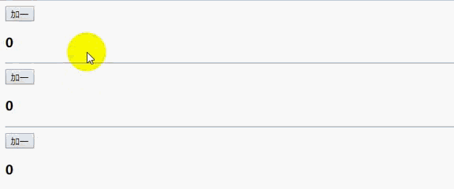
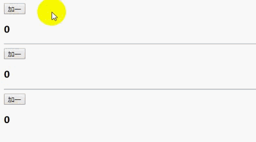
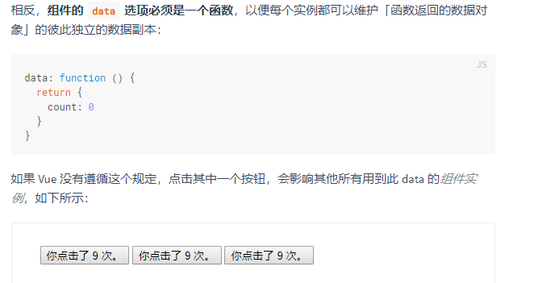

###**话不多说上代码测试：**

#### **定义一个全局组件，绑定msg**

- 我们首先看如果把data的值外传不在组件里面创建的效果

```html
<body>
  <div id="app">
    <counter></counter>
    <hr>
    <counter></counter>
    <hr>
    <counter></counter>
  </div>

  <template id="temp">
    <div>
        <input type="button" value="加一" @click='increment'>
        <h3>{{count}}</h3>
    </div>
  </template>

  <script>
    var dataObj={count:0}
    Vue.component('counter',{
      template:'#temp',
      data:()=>{
      	return dataObj
      },
      methods:{
        increment() {
          this.count++
        }
      }
    })

    var vm=new Vue({
      el:'#app',
      data:{},
      methods:{}
    });
  </script>
</body>.GIF
```



- 现在把dataObj注释， return {count:0}

```js
//var dataObj={count:0}
    Vue.component('counter',{
      template:'#temp',
      data:()=>{
        return {count:0}
      },
      methods:{
        increment() {
          this.count++
        }
      }
    })
```

​			

### 总结：

#### 官网解释比较抽象：

​			

> 不难看出，这里的关键点就在于  return {} 这个地方 如果是作用域外传入对象的话，上面三个组件的click方法都是处理的这个外部对象里面的count，所以他们作用于同样一个变量，但是如果是 return {count : 0}的话是写在template 内部的，所以每当你在page上渲染一个组件就会响应的创建一个count ，所以他们互不干预，在事件使用中我们可以根据这个小小的点实现不同需求的功能而省去多余的代码


