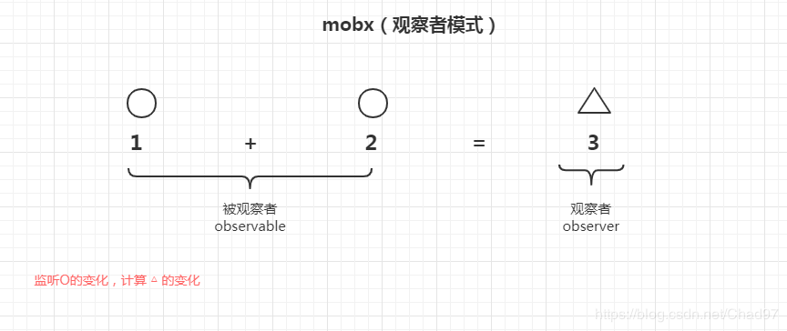

## Mobx-basic(快速上手)莞式教程

之前写过一篇 redux 的教程 可以参考[redux 的教程](https://blog.csdn.net/ruoduan-hub/article/details/89522403)

本篇讲通过通俗易懂的方式让你快速上手 mobx 的基本使用，虽然已经可以满足大部分开发中的需求但是详细 请参考[中文官方文档](https://cn.mobx.js.org/)

本篇配[教程代码](https://github.com/ruoduan-hub/mobx-basic) https://github.com/Chad97/mobx-basic

> 如果对想要快速入门的你有所帮助请给点个小小的 start 吧~

### 概述

1. 本篇采用的是 mobx5 和 react 16.8, 均才用最新版本库所做示范在有的 API 和其他版本可能有所差异，如严格模式
2. 本篇纯属原创 转载请注明出处

我们先来简单的看下官网的介绍

> MobX 是一个经过战火洗礼的库，它通过透明的函数响应式编程(transparently applying functional reactive programming - TFRP)使得状态管理变得简单和可扩展。MobX 背后的哲学很简单:

其实你可以简单的理解成 mobx 是一个 excel 的计算表格


#### 你将要了解到：

**observable, autorun, computed, action, configure —— mobx**<br>**observer —— mobx-react**

#### 准备工作

因为本篇通篇使用 ES7 中的修饰器语法@，所以需要配置 bable，推荐使用
当然你也可以使用 [decorators](https://cn.mobx.js.org/refguide/modifiers.html) 为参考

1. 安装 `yarn add mobx mobx-react`
2. 启用修饰器 babel 支持 ES7 中的修饰器语法@
   - yarn eject 打开配置
   - 安装 babel 依赖
     `yarn add babel-plugin-transform-decorators-legacy --dev`
     `yarn add @babel/plugin-proposal-decorators`
3. 配置 webpack

```json
"babel": {
    "plugins": [
      [
        "@babel/plugin-proposal-decorators",
        {
          "legacy": true
        }
      ],
      [
        "@babel/plugin-proposal-class-properties",
        {
          "loose": true
        }
      ]
    ],
    "presets": [
      "react-app"
    ]
  }
```

#### start

---

##### 实例化对象容器

在全局文件下创建一个`state.js` ps 别问我为啥不叫 store 因为我喜欢
如下

```js
import { observable, autorun, computed, action, configure } from "mobx"
configure(true) //开启严格模式

class MyState {
  @observable num1 = 0
  @observable num2 = 100

  @action addNum1 = () => {
    this.num1++
  }

  @action addNum2 = () => {
    this.num2++
  }

  @action empty = () => {
    this.num1 = 0
    this.num2 = 0
  }

  @computed get total() {
    return this.num1 + this.num2
  }
}

const newState = new MyState()

export default newState
```

- 我们可以看到 我们使用 observable 观察了 num1 和 num2
- 写了三个触发行为 action 分别是 `addNum1 addNum2 empty`
- 一个计算 computed `total`
- 然后 实例化一个对象 `newState` 并且导出了

如果你用过 redux 那这里对应你来说 简直不要太简单，只不过 mobx 更加面向对象

##### 组件中触发状态

创建 一个父组件 `Mobx.jsx`

```js
import React from "react"
import { observer } from "mobx-react"

import newState from "./state"

import AllNum from "./child/AllNum"
import Main from "./child/Main"

@observer
class Mobx extends React.Component {
  constructor(props) {
    super(props)
    this.state = {}
  }

  render() {
    return (
      <>
        <AllNum store={newState} />
        <br />
        <hr />
        <Main store={newState} />
        <br />
        <hr />
        <button onClick={newState.empty}>清零</button>
      </>
    )
  }
}

export default Mobx
```

- 我们可以看到这里导入了 `newState` 通过 empty 触发 action
- 而子组件 通过 props 把 newState 传递过去了

##### 2 个子组件

AllNum.jsx

```js
import React from "react"
import { observer } from "mobx-react"

const AllNum = observer(props => <div>num1 + num2 = {props.store.total}</div>)

export default AllNum
```

Main.jsx

```js
import React from "react"
import { observer } from "mobx-react"

const Main = observer(props => (
  <div>
    <p>num1 = {props.store.num1}</p>
    <p>num2 = {props.store.num2}</p>
    <div>
      <button style={{ marginRight: "5em" }} onClick={props.store.addNum1}>
        num1 + 1
      </button>
      <button onClick={props.store.addNum2}>num2 + 1</button>
    </div>
  </div>
))

export default Main
```

- props 接收 父组件传过来的 `newState`

当然如果你的组件签到太深，觉得 上面 2 中方式太麻烦你也可以使用 `react Context`来传递 newState，这里就不多做概述，[具体参考](https://react.docschina.org/docs/context.html)

#### 运行机制

贴一张官方的图

可以发现 对比 redux mobx 的方式人更容易理解是使用
面向对象的方式也让人用起来 不用写许多许多 render 感觉恶心

redux 教程链接 https://blog.csdn.net/ruoduan-hub/article/details/89522403

最后 大家可以 clone 我的 deom 教程作为参考哦~
https://github.com/ruoduan-hub/mobx-basic
喜欢的 大爷点个 star 哦~
