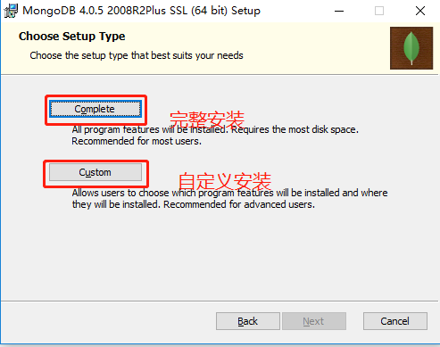
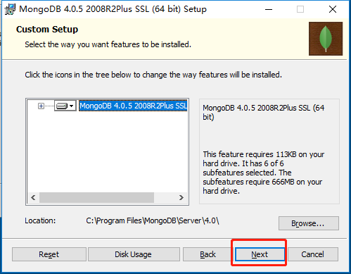
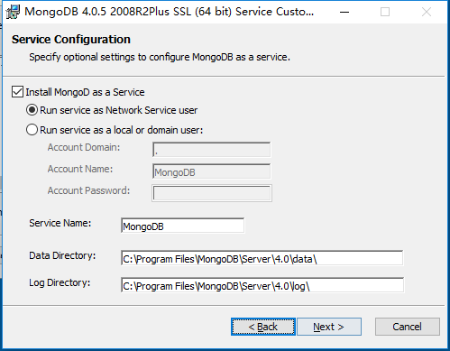
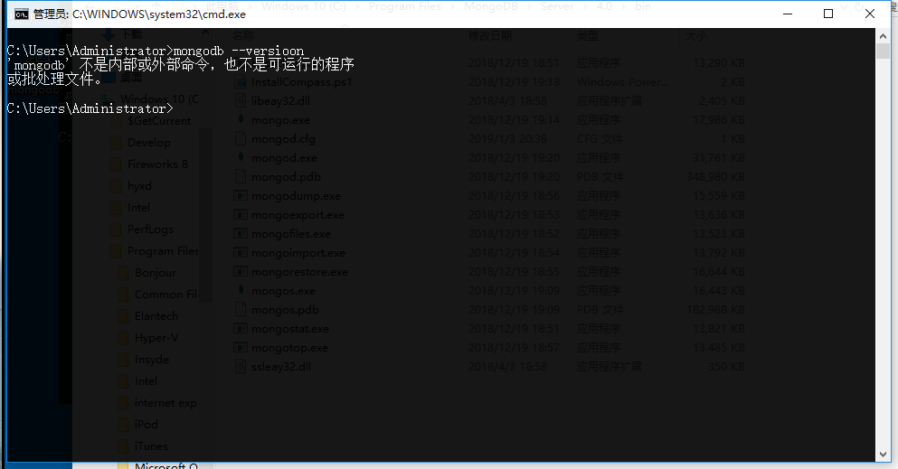
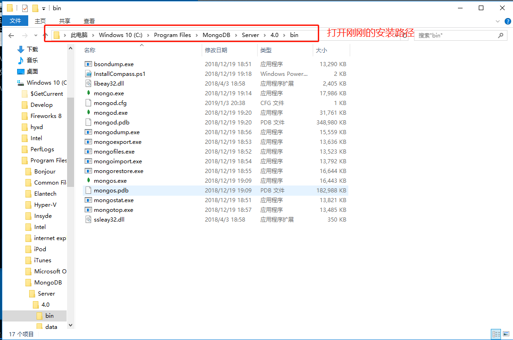
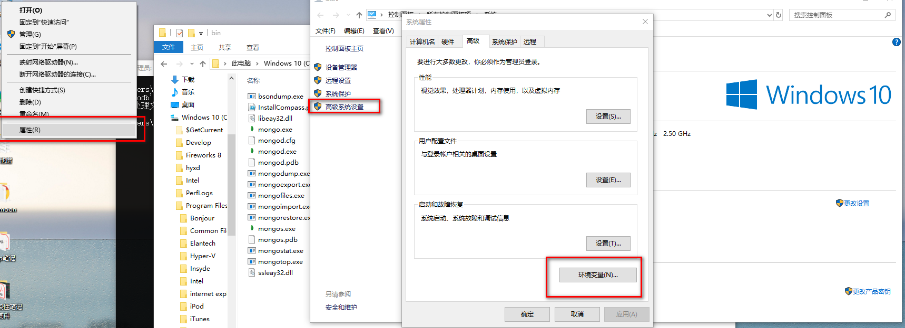
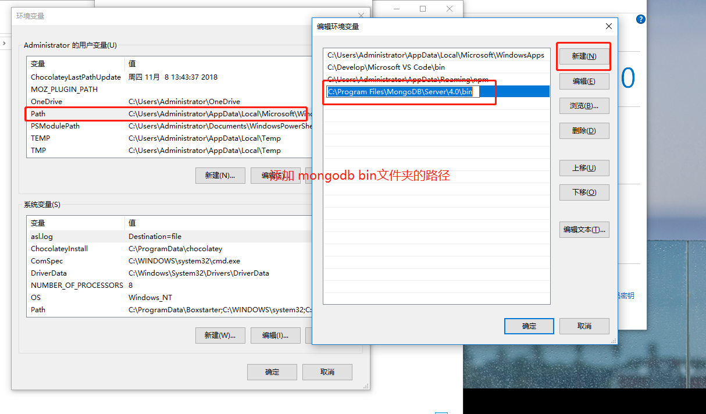
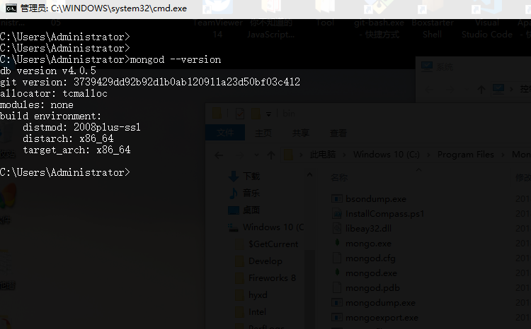
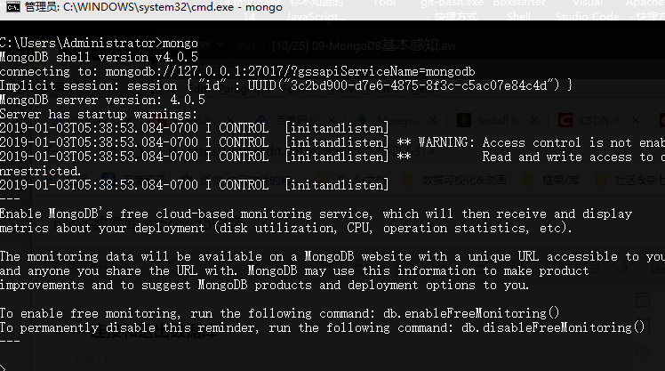

### 简介

NoSQL，指的是非关系型的数据库。NoSQL 有时也称作 Not Only SQL 的缩写，是对不同于传统的关系型数据库的数据库管理系统的统称。
NoSQL 用于超大规模数据的存储。（例如谷歌或 Facebook 每天为他们的用户收集万亿比特的数据）。这些类型的数据存储不需要固定的模式，无需多余操作就可以横向扩展。

具体链接： [菜鸟教程](http://www.runoob.com/mongodb/nosql.html)

- 第一步**下载**：【下载地址】：https://www.mongodb.com/download-center/community

根据自己的操作系统和需求下载：我这里选择的是社区版的

下载完成后点击安装：


完成安装顾名思义 next 就完了

我这里选择的自定义安装 看看有哪些东西



**next**



选择相应的安装文件夹，这里的安装路径在后面配置 环境变量的时候要用到

一直 next 安装完成后 我们用 命令行 看一下 有没有安装成功

- 用 mongod -- vesrion
  

可以看到 并没有 显示版本号 ，因为我们还没有配置环境变量，下面来配置一下环境变量

### 配置环境变量



- 打开安装路径找到 bin 的路径复制



找到系统-环境变量


- 现在我们再来 mongod -version
  

好了 到这一步 就说明 我们的 mongodb 安装成功了

### 开启和停止

mongodb 数据库和其他 sql 系列数据库有些不同，他在安装成功后，在我我们的服务列表是没有的，需要我们去手动安装，已达到 点击完成启动和停止的效果
安装服务的 方法 具体参考菜鸟教程 ：http://www.runoob.com/mongodb/mongodb-window-install.html

我这里就是一把梭 /手动狗头~

但是：这边并不影响我们的使用 我们可以通过命令行来启动和停止他 —— 非常简单
服务启动命令：mongod
停止：直接 Ctrl+C or 关闭窗口
**ps：** 这里有个注意点：

**mongodb 默认使用 mongod 命令所在的盘符的磁盘更目录作为自己的数据存储目录也就是
目录盘符/data/db**

#### 第一次启动

**所以在第一次启动的时候要去 手动创建一个 data/db 这样的数据存储目录**

当然我们也可以手动 修改 默认数据储存目录

```shell
mongod --dbpath=数据储存目录
```

#### 连接和退出数据库

```shell
#先启动数据库
mongod

#再开启一个控制台
mongo
```

退出：exit 就可以了



### 基本命令

- show dbs
  - 查看显示所有数据库
    默认有一个 admin 和 local 系统自带的
- db
  - 查看当前操作的数据库
- use 数据库名字

  - 切换到指定数据库（如果没有会新建）
    > ps：如果数据库里面没有数据 show db 是看不到这个数据库的

- 插入数据

```shell
# 插入一条 集为students的数据
db.students.insertOne({"id":"1","name":"Tom"}).students.insert

#查看当前集
 show collections
#查看当前集下面对 所有数据
> db.students.find()
> 如下：
{ "_id" : ObjectId("5c2e19bf5d2f7705c12fcb62"), "id" : "1", "name" : "Tom" }
```

**当然这边的操作 只是一个初体验，我们在真正使用的时候是不会用这种方式去使用的，用一些语言 例如 nodejs Ruby 等一些 语言来实现 CRUD 的操作**

- **_下面我们使用 mongoose 进行一些简单的 CRUD_**

## Nodejs-mongodb，mongoose 的 CRUD

### 前言

- 设计集合结构（表结构）
- 字段名称就是表结构的属性名称
- 约束的目的就是为了保证字段的完整性，不要有脏数据
  - 接上一篇 https://blog.csdn.net/Chad97/article/details/85720537
  - [官方 API](https://mongoosejs.com/docs/guide.html)

#### 官方案例

```js
var mongoose = require("mongoose") //官方案例
var Schema = mongoose.Schema
var blogSchema = new Schema({
  title: String,
  author: String,
  body: String,
  comments: [{ body: String, date: Date }],
  date: { type: Date, default: Date.now },
  hidden: Boolean,
  meta: {
    votes: Number,
    favs: Number,
  },
})
```

#### 小栗子

```js
var mongoose = require("mongoose")
var Schema = mongoose.Schema
//连接数据库
//指定链接的的数据库不需要存在，当你插入第一条数据后就会被自动创建出来
mongoose.connect("mongodb://localhost:27017/itcast")

//设计文档结构（表结构）
var userSchema = new Schema({
  username: {
    type: String,
    require: true, //表示必须有
  },
  password: {
    type: String,
    require: true,
  },
  email: {
    type: String,
  },
})
```

- 将文档结构发布为模型

  - mongoose.model() 是用来讲一个架构发布为 model 的

    - 第一个参数：传入一个大写名词单数字符串用来表示你的数据库名称，mongoose 会自动将大写单数名词字符串

  - 生成 小写复数 的集合名称 例如这里的 User => users 集合名称

  - 第二个参数：架构的名称

    - 返回值 模型构造函数

    **var User = mongoose.model('User', userSchema)**

* 增加数据
  - 先 new 一个数据对象
  - 使用模型.save（）添加

```js
var admin = new User({
  username: "zx",
  password: "321",
  email: "zx@ad.com",
})
admin.save(function(err, ret) {
  if (err) {
    console.log("保存失败")
  } else {
    console.log("保存成功")
    console.log(ret)
  }
})
```

- 查询

```js
		User.find(function (err,ret) { //查询所有
		    if (err) {
		        console.log('查询失败');
		    } else {
		        console.log(ret)
		    }
		})

		User.find({ //按条件查询  第一个参数 放入一个 对象 "条件" 即可
		        username: 'zx'
		    },
		    function (err, ret) {
		        if (err) {
		            console.log('查询失败');
		        } else {
		            console.log(ret)
		        }
		    })
		ps ：find() 无论 怎样都会返回一个数组

		User.findOne({ //插入条件后 只会返回一个对象，如果没有条件默认返回第一条数据
		    username: 'zx'
		    },
		    function (err,ret) {
		        if (err) {
		            console.log('查询失败');
		        } else {
		            console.log(ret);
		        }
		    }
		)
```

- 更新数据

```js
User.findByIdAndUpdate(
  "5c2f01c67677e410308a223a",
  {
    username: "updata后的admin",
    password: "666666",
  },
  function(err, ret) {
    if (err) {
      console.log("更新失败")
    } else {
      console.log("更新成功")
      console.log(ret) // 这里是返回更新前的对象内容
    }
  }
)
```

- 删除数据

```js
User.remove(
  {
    username: "zx",
  },
  function(err, ret) {
    if (err) {
      console.log("失败")
    } else {
      console.log("成功")
      console.log(ret)
    }
  }
)
```

### 附赠 mysql

- npm i --S mysql //下载包

```js
var mysql = require("mysql")

// 1. 创建连接
var connection = mysql.createConnection({
  host: "localhost",
  user: "root",
  password: "root",
  database: "users", // 数据库名字
})

// 2. 连接数据库 打开冰箱门
connection.connect()

// 3. 执行数据操作 把大象放到冰箱
connection.query("SELECT * FROM `users`", function(error, results, fields) {
  if (error) throw error
  console.log("The solution is: ", results)
})

// connection.query('INSERT INTO users VALUES(NULL, "admin", "123456")', function (error, results, fields) {
//   if (error) throw error;
//   console.log('The solution is: ', results);
// });

// 4. 关闭连接 关闭冰箱门
connection.end()
```
