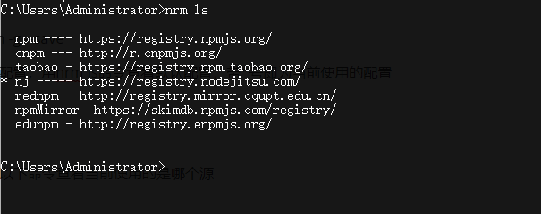
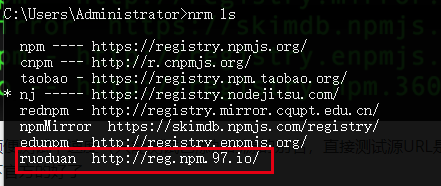
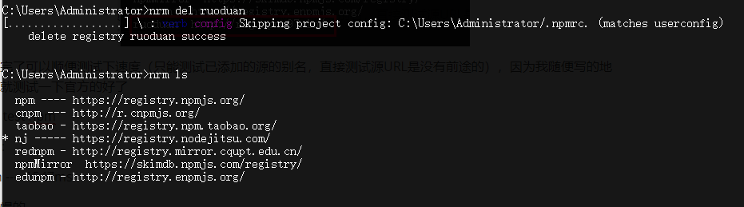

## npm

- node package manager——网站 npmjs.com

---

- 只要安装了 node 就安装了 npm

- nm 也有版本概念

  ```javascript
  npm --version //查看版本号

  npm install --global npm //升级npm版本
  ```

### 一些常用命令

- npm init //生成 package.json 文件
  - npm init -y //快速生成 跳过向导
- npm install 包名 //下载
- npm install //一次性把 package.json 中的 dependencies 依赖项全部安装
  - npm install --save //下载并保持依赖项目到 package.json 中的 dependencies
  - 简写 npm i -S 包名

* npm uninstall 包名 //只删除 如果有依赖项 依然保存
* npm uninstall --save //删除 同时也会把依赖信息也删除
  - 简写 npm un -S 包名

- npm --help //查看使用帮助
  - npm 命令 --help //查看具体使用帮助
  - 例如 npm uninstall --help

```shell
npm uninstall [<@scope>/]<pkg>[@<version>]... [--save-prod|--save-dev|--save-optional] [--no-save]

aliases: un, unlink, remove, rm, r
## alias 别名
```

具体 命令 请[参考](http://www.cnblogs.com/itlkNote/p/6830682.html)

### npm 切换源，解决 npm 被墙问题

当使用官方 npm 源安装各种包比较慢的时候，建议修改 npm 源地址

查看 npm 源地址，在终端输入以下命令

npm config list

会看到官方的 npm 源

```
metrics-registry = "https://registry.npmjs.org/"
```

国内常用的镜像地址如淘宝 npm：https://registry.npm.taobao.org/

修改 registry 地址很简单，在终端输入

npm set registry https://registry.npm.taobao.org/

如果有一天你肉身 FQ 到国外，用不上了，用 rm 命令删掉它

npm config rm registry

如果某一天你又被遣送回国了，还是得加上它……

有些大公司还需要在公司的私有 npm 源和外部 npm 源之间来回切换，这样 set 来 rm 去不是办法，于是有了[nrm](https://github.com/Pana/nrm)

**nrm 是专门用来管理和快速切换私人配置的 registry**

建议全局安装

npm install nrm -g --save

nrm 有一些默认配置，用 nrm ls 命令查看默认配置，带\*号即为当前使用的配置

nrm ls



也可以直接输入以下命令查看当前使用的是哪个源

nrm current

切到源http://r.cnpmjs.org/，命令：nrm use 源的别名，即

nrm use cnpm

执行成功提示

```
Registry has been set to: http://r.cnpmjs.org/
```

用 nrm add 命令添加公司私有 npm 源，如http://registry.npm.360.org(随便写的)，起个别名叫qihoo

nrm add qihoo http://registry.npm.360.org

接着查看 nrm 配置，发现最底部 qihoo 添加成功



添加完了可以顺便测试下速度（只能测试已添加的源的别名，直接测试源 URL 是没有前途的），因为我随便写的地址，就测试一下官方的好了

nrm test npm

输出：

npm ---- 1547ms

是挺慢的。

最后，如果你被公司开除了，怒删公司 npm 源配置

nrm del qihoo


