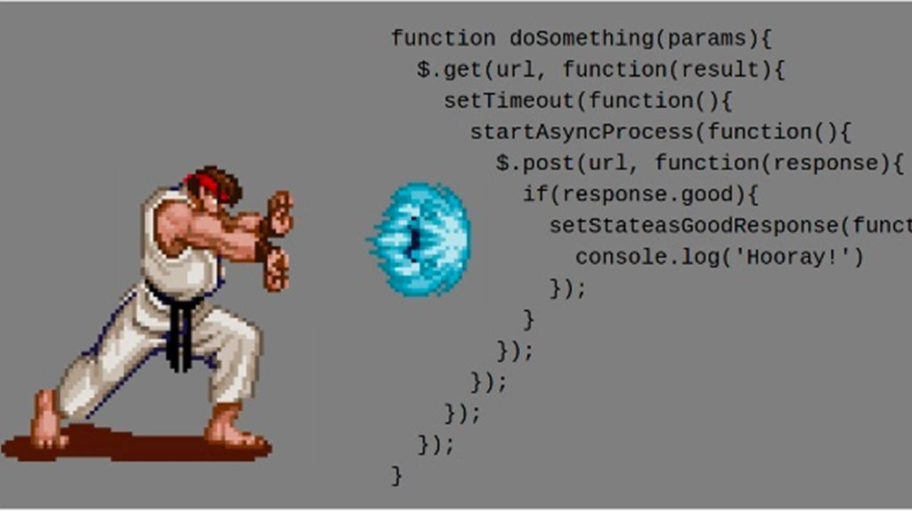

- 具体参考 [阮一峰,ES6 标准入门](http://es6.ruanyifeng.com/#docs/promise)
- 在我们需要对一个异步操作进行频繁的调用的时候，且要保证一步操作的顺序，可能会出现
- 回调地狱（callback）的情况 例如：

### 嵌套方式

```js
var fs = require("fs")

fs.readFile("../data/a.txt", "utf8", function(err, data) {
  if (err) {
    throw err
  }
  console.log(data)

  fs.readFile("../data/b.txt", "utf8", function(err, data) {
    if (err) {
      throw err
    }
    console.log(data)

    fs.readFile("../data/c.txt", "utf8", function(err, data) {
      if (err) {
        throw err
      }
      console.log(data)
    })
  })
})
```



### promise 方式

解决这个问题让我们的代码看起来更加直观，我们可以用 promise 解决这个问题

```js
var p1 = new Promise(function(resolve, reject) {
  fs.readFile("../data/a.txt", "utf8", function(err, data) {
    if (err) {
      reject(err)
    } else {
      resolve(data)
    }
  })
})

var p2 = new Promise(function(resolve, reject) {
  fs.readFile("../data/b.txt", "utf8", function(err, data) {
    if (err) {
      reject(err)
    } else {
      resolve(data)
    }
  })
})

var p3 = new Promise(function(resolve, reject) {
  fs.readFile("../data/c.txt", "utf8", function(err, data) {
    if (err) {
      reject(err)
    } else {
      resolve(data)
    }
  })
})

//console.log(p1)  //Promise { <pending> }

p1.then(
  function(data) {
    console.log(data) //读取成功
    return p2 //把下一个要读取的promise返回
  },
  function(err) {
    //第二个参数表示读取失败 reject 拒绝了
    console.log(err + "p1失败")
  }
)

  .then(
    function(data) {
      console.log(data)
      return p2
    },
    function(err) {
      console.log(err + "p2失败")
    }
  )

  .then(
    function(data) {
      console.log(data)
    },
    function(err) {
      console.log(err + "p3失败")
    }
  )

// 这样子就实现了promise 链式编程，但是重复的代码太多，
//下面稍微改造一下封装一个方法
```

**但是这样子的代码复用太多，我们可以给他稍微封装一下**

```js
var fs = require("fs")

function PreadFile(filePath) {
  return new Promise(function(resolve, reject) {
    fs.readFile(filePath, "utf8", function(err, data) {
      if (err) {
        reject(err)
      } else {
        resolve(data)
      }
    })
  })
}

PreadFile("../data/a.txt")
  .then(
    function(data) {
      console.log(data)
      return PreadFile("../data/b.txt")
    },
    function(err) {
      console.log(err + "a文件失败")
    }
  )

  .then(
    function(data) {
      console.log(data)
      return PreadFile("../data/c.txt")
    },
    function(err) {
      console.log(err + "b文件失败")
    }
  )

  .then(
    function(data) {
      console.log(data)
    },
    function(err) {
      console.log(err + "c文件失败")
    }
  )
```

输出：a b c ，当然 这里的 function 用箭头函数代替更简洁，但涉及我书写 blog 的前后顺序和结构进性，在写 es6 前就尽量不使用 es6 语法糖

### Promise.all 和 Promise.race

#### Promise.all

Promise.all 可以将多个 Promise 实例包装成一个新的 Promise 实例。同时，成功和失败的返回值是不同的，成功的时候返回的是一个结果数组，而失败的时候则返回最先被 reject 失败状态的值。
具体代码如下：

```js
let p1 = new Promise((resolve, reject) => {
  resolve("成功了")
})

let p2 = new Promise((resolve, reject) => {
  resolve("success")
})

let p3 = Promse.reject("失败")

Promise.all([p1, p2])
  .then(result => {
    console.log(result) //['成功了', 'success']
  })
  .catch(error => {
    console.log(error)
  })

Promise.all([p1, p3, p2])
  .then(result => {
    console.log(result)
  })
  .catch(error => {
    console.log(error) // 失败了，打出 '失败'
  })
```

Promse.all 在处理多个异步处理时非常有用，比如说一个页面上需要等两个或多个 ajax 的数据回来以后才正常显示，在此之前只显示 loading 图标。
代码模拟：

```js
let wake = time => {
  return new Promise((resolve, reject) => {
    setTimeout(() => {
      resolve(`${time / 1000}秒后醒来`)
    }, time)
  })
}

let p1 = wake(3000)
let p2 = wake(2000)

Promise.all([p1, p2])
  .then(result => {
    console.log(result) // [ '3秒后醒来', '2秒后醒来' ]
  })
  .catch(error => {
    console.log(error)
  })
```

- 需要特别注意的是，Promise.all 获得的成功结果的数组里面的数据顺序和 Promise.all 接收到的数组顺序是一致的，即 p1 的结果在前，即便 p1 的结果获取的比 p2 要晚。这带来了一个绝大的好处：在前端开发请求数据的过程中，偶尔会遇到发送多个请求并根据请求顺序获取和使用数据的场景，使用 Promise.all 毫无疑问可以解决这个问题。

#### Promise.race

顾名思义，Promse.race 就是赛跑的意思，意思就是说，Promise.race([p1, p2, p3])里面哪个结果获得的快，就返回那个结果，不管结果本身是成功状态还是失败状态。

```js
let p1 = new Promise((resolve, reject) => {
  setTimeout(() => {
    resolve("success")
  }, 1000)
})

let p2 = new Promise((resolve, reject) => {
  setTimeout(() => {
    reject("failed")
  }, 500)
})

Promise.race([p1, p2])
  .then(result => {
    console.log(result)
  })
  .catch(error => {
    console.log(error) // 打开的是 'failed'
  })
```

原理是挺简单的，但是在实际运用中还没有想到什么的使用场景会使用到。

### 总结

- Promise 是异步编程的一种解决方案，比传统的解决方案——回调函数和事件——更合理和更强大。它由社区最早提出和实现，ES6 将其写进了语言标准，统一了用法，原生提供了 Promise 对象。
- 所谓 Promise，简单说就是一个容器，里面保存着某个未来才会结束的事件（通常是一个异步操作）的结果。从语法上说，Promise 是一个对象，从它可以获取异步操作的消息。Promise 提供统一的 API，各种异步操作都可以用同样的方法进行处理。
- Promise 对象有以下两个特点。
  - （1）对象的状态不受外界影响。Promise 对象代表一个异步操作，有三种状态：pending（进行中）、fulfilled（已成功）和 rejected（已失败）。只有异步操作的结果，可以决定当前是哪一种状态，任何其他操作都无法改变这个状态。这也是 Promise 这个名字的由来，它的英语意思就是“承诺”，表示其他手段无法改变。
  - （2）一旦状态改变，就不会再变，任何时候都可以得到这个结果。Promise 对象的状态改变，只有两种可能：从 pending 变为 fulfilled 和从 pending 变为 rejected。只要这两种情况发生，状态就凝固了，不会再变了，会一直保持这个结果，这时就称为 resolved（已定型）。如果改变已经发生了，你再对 Promise 对象添加回调函数，也会立即得到这个结果。这与事件（Event）完全不同，事件的特点是，如果你错过了它，再去监听，是得不到结果的。
- 注意，为了行文方便，本章后面的 resolved 统一只指 fulfilled 状态，不包含 rejected 状态。
- 有了 Promise 对象，就可以将异步操作以同步操作的流程表达出来，避免了层层嵌套的回调函数。此外，Promise 对象提供统一的接口，使得控制异步操作更加容易。
- Promise 也有一些缺点。首先，无法取消 Promise，一旦新建它就会立即执行，无法中途取消。其次，如果不设置回调函数，Promise 内部抛出的错误，不会反应到外部。第三，当处于 pending 状态时，无法得知目前进展到哪一个阶段（刚刚开始还是即将完成）。
  如果某些事件不断地反复发生，一般来说，使用 Stream 模式是比部署 Promise 更好的选择。
