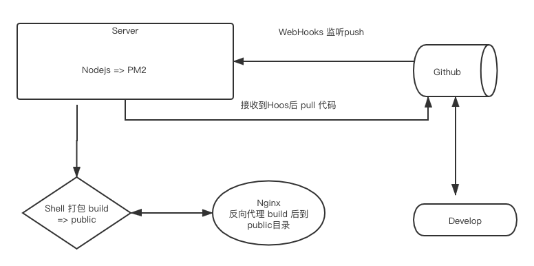
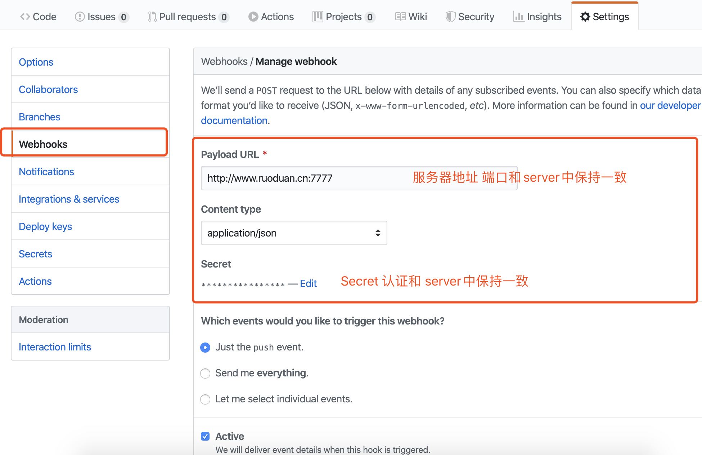

## 缘起

> 最近用Gatsby 写了一个个人blog，link => http://new.ruoduan.cn/

[Github](https://github.com/Chad97/my-Gatsby-Blog) 🙏🙏🙏 Star


发现 `build` 后体积太大，FTP 发文件 都要10几分钟，挑选来下自动化部署工具🔧，本打算用`jenkins`  感觉有点重，而且学习成本较高。
看了一下觉得 使用 github的webHooks 是最合适的


## Graph
大致流程是这样的：👇




- 话不多说直接上代码 代码分为三个部分

1. Nodejs => Server
2. Shell 脚本
3. 插件

### install
> 我的环境是 CentOS 

服务器 应具备 nodejs && git

- 首先先安装 github-webhooks的插件和pm2 `服务器上`
`npm install -g github-webhook-handler pm2`

#### nodejs 服务
webhooks.js
```js
var http = require('http')
// github-webhook-handler 的绝对路径
var createHandler = require('/usr/lib/node_modules/github-webhook-handler')
var handler = createHandler({ path: '/', secret: 'xxx' })
// 上面的 secret 保持和 GitHub 后台设置的一致

function run_cmd(cmd, args, callback) {
  var spawn = require('child_process').spawn;
  var child = spawn(cmd, args);
  var resp = "";

  child.stdout.on('data', function(buffer) { resp += buffer.toString(); });
  child.stdout.on('end', function() { callback (resp) });
}

http.createServer(function (req, res) {
  handler(req, res, function (err) {
    res.statusCode = 404
    res.end('no such location')
  })
}).listen(7777) // 启动服务的端口，需要开放安全组

handler.on('error', function (err) {
  console.error('Error:', err.message)
})

handler.on('push', function (event) {
  console.log('Received a push event for %s to %s',
    event.payload.repository.name,
    event.payload.ref);
    run_cmd('sh', ['./webhooks.sh',event.payload.repository.name], function(text){ console.log(text) });
})
```


#### shell

webhooks.sh
```shell
 #!/bin/bash
WEB_PATH='/root/githubWebhook/warehouse/my-Gatsby-Blog'


echo "开始执行shell"
cd $WEB_PATH
echo "pulling source code..."
git pull
echo "changing permissions..."
#chown -R $WEB_USER:$WEB_USERGROUP $WEB_PATH
echo " git pull 完成. 开始 build"
yarn run gatsby build
echo "build 完成"
```

到这里 我们`服务端`需要准备的东西就差不多了 Nginx 就不放出来

### Github Settings

放一张图吧




### start 

接下来 pm2 启动服务

`pm2 start webhooks.js -o ./webhooks.log` 

[pm2的一些基本命令](https://www.jianshu.com/p/3de4e8f15621)


### 写在最后

接下来 我还会更新一篇 长文 Gatsby 的文章 详细指出 其中的利弊，无论你是 新手还是想使用现代框架 ——— React 来维护我自己的blog 的老手 都非常适合

我的 [New Blog => ](http://new.ruoduan.cn/)http://new.ruoduan.cn/

年后想换个工作，求内推！求内推！求内推！ Live：杭州

我的一些信息 可查看我的 Blog about 部分 http://new.ruoduan.cn/about


