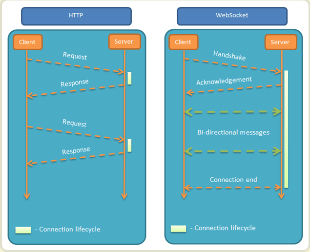
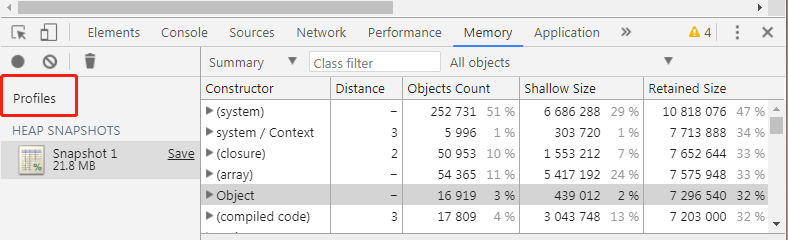
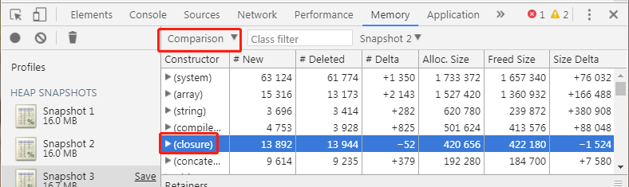

> 岗位 web前端
>
> 我的csdn：[me.csdn.net/Chad97](https://link.juejin.im/?target=https%3A%2F%2Fme.csdn.net%2FChad97)
>
> 个人博客：Ruoduan.top

------

### 敲黑板 知识点:

#### **websocket**：

websocket是HTML5的一个新协议，它允许服务端向客户端传递信息，实现浏览器和客户端双工通信。websocket弥补了HTTP不支持长连接的特点，那么在学习websocket之前我们先来了解以下HTTP


# HTTP

HTTP是用于传输如HTML文件,图片文件，查询结果的应用层协议。它被设计于用于服务端和客户端之间的通信。在工作的时候，客户端打开一个连接以发出请求，然后等待服务端响应，服务端不能主动向客户端发送请求。HTTP是无状态协议，意味着服务器不会在两个请求之间保留任何数据。那么这就带来了一个问题，比如说在一个电商网站中，把某个物品加入了购物车，换了一个页面后，在添加一个物品，两次添加物品的请求没有联系，浏览器无法知道用户选择了那些商品。解决方法是在HTTP头部中加入cookie信息这样每次请求都能够共享相同的状态。

## 那么HTTP请求响应的工作流程是什么呢？

1、客户端连接到web服务器，与web服务器的HTTP端口（默认是80）建立一个TCP套接字连接
2、发送HTTP请求 通过TCP套接字，客户端向服务器发送一个文本的请求报文，一个请求报文由请求行，请求头部，空行和请求数据四个部分构成
3、服务端接受请求并返回HTTP响应 web服务器解析请求，定位请求资源。服务器将资源复本写到TCP套接字，由客户端读取。一个响应由状态行、响应头部、空行和响应数据4部分组成。
4、释放连接TCP连接 Web服务器主动关闭TCP套接字，释放TCP连接；客户端被动关闭TCP套接字，释放TCP连接。
5、客户端浏览器解析HTML内容 客户端浏览器首先解析状态行，查看表明请求是否成功的状态代码。然后解析每一个响应头，响应头告知以下为若干字节的HTML文档和文档的字符集。客户端浏览器读取响应数据HTML，根据HTML的语法对其进行格式化，并在浏览器窗口中显示。
关于HTTP内容不多讲，太多了我也讲不了。推荐大家去看《HTTP权威指南》很小的一本书，讲的很清楚。

# HTTPS

HTTPS是什么呢，他与HTTP的关系又是什么。在上一段讲过HTTP是我们平时浏览网页时使用的一种协议。HTTP协议传输的数据都是没有加密的，也就是明文的，因此使用HTTP协议传输隐私信息非常的不安全。**为了让这些隐私数据能够加密传输，便设计了SSL协议对HTTP传输的数据进行加密，从而诞生了HTTPS。**而后对SSL进行不断的升级，出现了TLS。但是呢，名字用久了也就产生了感情，所以也一直延续着SSL是HTTPS的代名词的习惯。
下面这张图能够让你很清晰的认识到HTTP和HTTPS之间的关系这儿有一张图


那么HTTPS的加密到底是怎么一回事呢。

## 加密过程如下:

1、浏览器将自己支持的一套加密规则发送给网站。
2、网站从中选出一组加密算法与HASH算法，并将自己的身份信息以证书的形式发回给浏览器。证书里面包含了网站地址，加密公钥，以及证书的颁发机构等信息。
3、获得网站证书之后浏览器要做以下工作：
(1) 验证证书的合法性（颁发证书的机构是否合法，证书中包含的网站地址是否与正在访问的地址一致等），如果证书受信任，则浏览器栏里面会显示一个小锁头，否则会给出证书不受信的提示。
(2) 如果证书受信任，或者是用户接受了不受信的证书，浏览器会生成一串随机数的密码，并用证书中提供的公钥加密。
(3) 使用约定好的HASH计算握手消息，并使用生成的随机数对消息进行加密，最后将之前生成的所有信息发送给网站。
4、网站接收浏览器发来的数据之后要做以下的操作：
(1) 使用自己的私钥将信息解密取出密码，使用密码解密浏览器发来的握手消息，并验证HASH是否与浏览器发来的一致。
(2) 使用密码加密一段握手消息，发送给浏览器。
5、浏览器解密并计算握手消息的HASH，如果与服务端发来的HASH一致，此时握手过程结束，之后所有的通信数据将由之前浏览器生成的随机密码并利用对称加密算法进行加密。


# websocket

讲了这么多终于讲到了websocket。websocket相对与HTTP协议来说是一个持久化的协议。下面是一个典型的websocket握手

```shell
GET /chat HTTP/1.1
Host: server.example.com
Upgrade: websocket
Connection: Upgrade
Sec-WebSocket-Key: x3JJHMbDL1EzLkh9GBhXDw==
Sec-WebSocket-Protocol: chat, superchat
Sec-WebSocket-Version: 13
Origin: http://example.com
```

可以看到相对于HTTP的头部多了一个头部，其实我们就可以说，websocket借用了HTTP的握手，是HTTP的一个解决特定问题的补丁。 我们在看看上面的头部相对HTTP头部都有哪些变化。

```
Upgrade: websocket
Connection: Upgrade
```

这就是websocket的核心，告诉服务器这是websocket请求，而不是http请求

```powershell
Sec-WebSocket-Key: x3JJHMbDL1EzLkh9GBhXDw==
Sec-WebSocket-Protocol: chat, superchat
Sec-WebSocket-Version: 13
```

Sec-WebSocket-Key是一个Base64 encod的值，是一个随机生成的，用于验证是否是真正的websocket
然后Sec-WebSocket-Protocol是一个用户定义的字符串，用来区分同URL下，不同的服务需要不同的协议
Sec-WebSocket-Version这个不用说就是websocket的版本号。 那么服务端就会返回下列东西

```js
HTTP/1.1 101 Switching Protocols
Upgrade: websocket
Connection: Upgrade
Sec-WebSocket-Accept: HSmrc0sMlYUkAGmm5OPpG2HaGWk=
Sec-WebSocket-Protocol: chat
```

Sec-WebSocket-Accept表示经过服务器确认，并且对客户端的Sec-WebSocket-Key进行了加密。
Sec-WebSocket-Protocol表示最终使用的协议。
在工作的时候websocket和HTTP有哪些差异呢，下面这张图很好的表示了区别。

)

可以看到HTTP获取数据的时候，需要不断的问服务端是否有我要的数据啊，如果有数据就返回数据，没有就过一段时间再次询问服务端是否有我需要的数据。那websocket呢，它只建立一次连接，那么这个连接就不会断，服务端如果有数据的话，会自动返回数据给客户端，还有一个问题，在HTTP中我们提到，HTTP是无状态的，意思它健忘，上一次的请求和这次的请求都没什么联系，我们需要引用cookie才能解决。那么在websockt中，因为是一次长连接，那么这就不用一次次加入cookie，是不是方便很多了。 下面的代码就是websocket在前端代码中的应用


```js
if ('WebSocket' in window) {
  websocket = new WebSocket("地址");
} else {
    // 不支持websocket
}
websocket.send = ('msg')
alert(websocket.readyState) // websocket的准备状况
websocket.onerror = function(){}
websocket.onopen = function(){}
websocket.onmessage = function(){}
websocket.onclose = function(){}
```

好了 就到这里吧~


- 补充 一个 面试题  
 ## js内存泄露使用什么工具 如何排除？
- 当然这个也是我后期补的  大自然的 搬运工

1、使用工具Heap Profiling

①、Heap Profiling可以记录当前的堆内存（heap）的快照，并生成对象的描述文件，该描述文件给出了当时JS运行所用的所有对象，以及这些对象所占用的内存大小、引用的层级关系等等。

②、JS运行的时候，会有栈内存（stack）和堆内存（heap），当我们new一个类的时候，这个new出来的对象就保存在heap里，而这个对象的引用则存储在stack里。程序通过stack的引用找到这个对象。例如：var a = [1,2,3]，a是存储在stack中的引用，heap里存储着内容为[1,2,3]的Array对象。

③、打开调试工具，点击Memory中的Profiles标签，选中“Take Heap Snapshot”,点击“start”按钮，就可以拍在当前JS的heap快照了。




右边视图中列出了heap里的对象列表。

constructor：类名
Distance：对象到根的引用层级距离
Objects Count：该类的对象数
Shallow Size：对象所占内存（不包含内部引用的其他对象所占的内存）
Retained Size：对象所占的总内存（包含····················································）
点击上图左上角的黑圈圈，会出现第二个内存快照

2、内存泄露的排查



将上图框框切换到comparison（对照）选项，该视图列出了当前视图与上一个视图的对象差异

#New：新建了多少对象
#Deleted：回收了多少对象
#Delta：新建的对象个数减去回收的对象个数
重点看closure（闭包），如果#Delta为正数，则表示创建了闭包函数，如果多个快照中都没有变负数，则表示没有销毁闭包