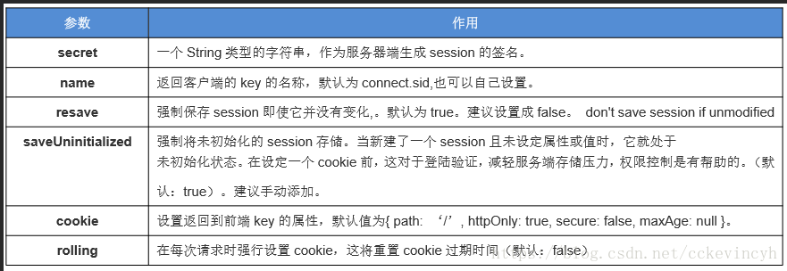

## express-session

[github 仓库](https://github.com/expressjs/session)

### session 介绍：

- session 是另一种记录客户状态的机制，不同的是 Cookie 保存在客户端浏览器中，而 session 保存在服务器上。

- Session 的用途：
  - session 运行在服务器端，当客户端第一次访问服务器时，可以将客户的登录信息保存。
    当客户访问其他页面时，可以判断客户的登录状态，做出提示，相当于登录拦截。
    session 可以和 Redis 或者数据库等结合做持久化操作，当服务器挂掉时也不会导致某些客户信息（购物车）
    丢失。

### session 的工作流程

- 当浏览器访问服务器并发送第一次请求时，服务器端会创建一个 session 对象，生成一个类似于
  key,value 的键值对，然后将 key(cookie)返回到浏览器(客户)端，浏览器下次再访问时，携带 key(cookie)，
  找到对应的 session(value)。 客户的信息都保存在 session 中

### 安装

- \$ npm install express-session

### API

- var session = require('express-session')

### 配置

```js
app.use(
  session({
    secret: "my key", //配置加密字符串,他会在原有加密基础上凭据上自己定义的字符串加密信息，防止客户端恶意伪造
    resave: false,
    saveUninitialized: true, //强制将为初始化的session 储存，无论是否使用session 都默认分配一个秘钥
  })
)
```



### 使用

- #### 官方案例

```js
var express = require("express")
var parseurl = require("parseurl")
var session = require("express-session")

var app = express()

app.use(
  session({
    secret: "keyboard cat",
    resave: false,
    saveUninitialized: true,
  })
)

app.use(function(req, res, next) {
  if (!req.session.views) {
    req.session.views = {}
  }

  // get the url pathname
  var pathname = parseurl(req).pathname

  // count the views
  req.session.views[pathname] = (req.session.views[pathname] || 0) + 1

  next()
})

app.get("/foo", function(req, res, next) {
  res.send("you viewed this page " + req.session.views["/foo"] + " times")
})

app.get("/bar", function(req, res, next) {
  res.send("you viewed this page " + req.session.views["/bar"] + " times")
})
```

- #### 简单调用

```js
req.session.foo = "bar" //添加

req.session.foo //获取
```

ps： 默认 session 是存储在内存中的，需要进行持久化存储，到数据库中
